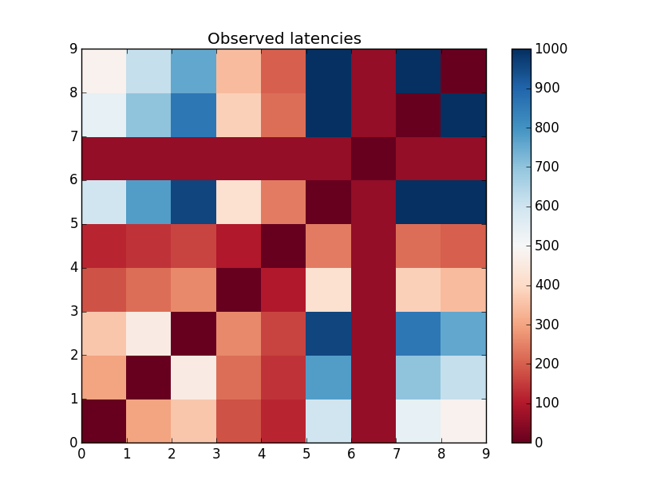

POC : Emulation of latencies and bandwidth constraints on G5K

```
vagrant up --provider=g5k
# generate the inventory, and constraint matrix
./setup.rb
# enforce the constraints
ansible-playbook -i inventory.generated setup.yml -e @constraints.yml
# validate the constraints
ansible-playbook -i inventory.generated test.yml
```

`delays` subdirectory contains the validation results.

```
─$ ls -l delays
total 88
-rw-r--r--  1 msimonin  staff  791  7 déc 23:49 netem0
-rw-r--r--  1 msimonin  staff  829  7 déc 23:49 netem1
-rw-r--r--  1 msimonin  staff  829  7 déc 23:49 netem2
-rw-r--r--  1 msimonin  staff  824  7 déc 23:49 netem3
-rw-r--r--  1 msimonin  staff  814  7 déc 23:49 netem4
-rw-r--r--  1 msimonin  staff  808  7 déc 23:49 netem5
-rw-r--r--  1 msimonin  staff  818  7 déc 23:49 netem6
-rw-r--r--  1 msimonin  staff  818  7 déc 23:49 netem7
-rw-r--r--  1 msimonin  staff  817  7 déc 23:49 netem8
-rw-r--r--  1 msimonin  staff  817  7 déc 23:49 netem9
-rw-r--r--  1 msimonin  staff   15  7 déc 23:41 readme
```

```
─$ cat delays/netem5
10.158.4.213 : 60.35 60.23 60.21 60.22 60.21
10.158.4.211 : 160.29 160.22 160.20 160.21 160.19
10.158.4.208 : 260.27 260.21 260.20 260.23 260.20
10.158.4.204 : 360.29 360.25 360.25 360.21 360.24
10.158.4.206 : 460.25 460.21 460.20 460.23 460.17
10.158.4.207 : 0.02 0.02 0.02 0.02 0.00
10.158.4.210 : 660.21 660.21 660.21 660.22 -
10.158.4.212 : 760.24 760.20 760.18 760.19 -
10.158.4.205 : 860.26 860.24 860.24 860.24 -
10.158.4.209 : 960.19 960.18 960.18 960.18 -

      10 targets
      10 alive
       0 unreachable
       0 unknown addresses

       4 timeouts (waiting for response)
      50 ICMP Echos sent
      46 ICMP Echo Replies received
       0 other ICMP received

 160 ms (min round trip time)
 423 ms (avg round trip time)
 960 ms (max round trip time)
        4.751 sec (elapsed real time)
```

Example of latencies between the nodes.


